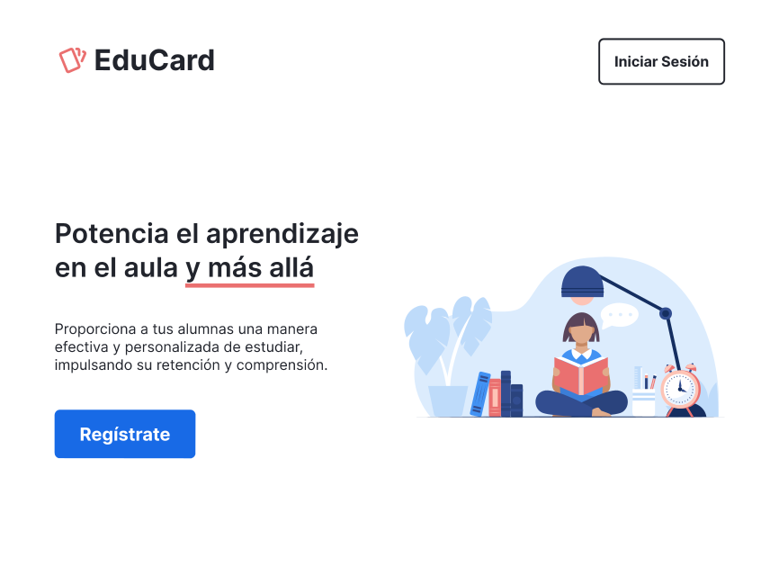

<p align="center">
  <br>
    
  <br>
</p>

# EduCard

EduCard is a web application that helps teachers develop their students' active recall and spaced repetition habits through the use of flashcards.

As a teacher: Create courses and decks of flashcards and share them with your students.

As a student: Study cards and get individual reminders to review them based on your recalling performance.

(Or do both!)

https://github.com/borjaMarti/educard/assets/86715948/09b5c951-99cb-41b0-b125-37d6aaaf6f16

## Table of contents

- [Overview](#overview)
  - [The challenge](#the-challenge)
  - [Features](#features)
  - [Links](#links)
- [My process](#my-process)
  - [Built with](#built-with)
  - [How I did it](#how-i-did-it)
  - [What I learned](#what-i-learned)
  - [Continued development](#continued-development)
  - [Useful resources](#useful-resources)
- [Installation](#installation)
  - [External dependencies](#external-dependencies)
  - [Environment variables](#environment-variables)
  - [Running](#running)
- [Author](#author)
- [Acknowledgments](#acknowledgments)

## Overview

### The challenge

The two study methods [proven to be the most effective](https://scholar.google.es/scholar_url?url=https://bibliotecadigital.mineduc.cl/bitstream/handle/20.500.12365/17388/dunloskyimprovinglearning.pdf&hl=en&sa=X&ei=iyMEZd7_CNmDy9YPj-Ki8Ag&scisig=AFWwaeaysE_TSEk3SAVaAbKvAOTU&oi=scholarr) are active recall testing, which consists of actively trying to remember the content we want to memorize, for example, by asking ourselves questions about what we just read, and spaced repetition, done by studying continuously and progressively, as opposed to cramming everything the day before an exam. A very efficient way to combine these techniques is using flashcards. By following a system such as [Leitner's](https://en.wikipedia.org/wiki/Leitner_system), we can determine which cards need a higher frequency of repetition to consolidate, thus flattening the specific [forgetting curve](https://en.wikipedia.org/wiki/Forgetting_curve) of each one without wasting time reviewing the information we've already memorized.

(If you want a more in-depth look into the topic, checkout the [Useful resources](#useful-resources) section)

These are the reasons why, for my personal study, I use a flashcards app, [Anki](https://apps.ankiweb.net/). Anki allows users to create their own decks of flashcards, study them, and schedule the cards' next study session following an algorithm based on the difficulty they had recalling. While working as a teacher, I wanted to help my students develop their study habits and techniques through the use of a similar system. While Anki is a very powerful tool, it may prove too complex for younger students. It's also oriented towards personal learning, so it lacks features that allow users to interact with each other in direct ways (you can share decks, but only through exporting/importing files). When thinking about the use of flashcards with students, I felt I needed a more streamlined tool, which was easy to use, and allowed teachers to create and share decks with their students in a non-cumbersome way.

Enter [EduCard](https://educard.es).



EduCard's objective is to give teachers (and students) an easy-to-use tool that allows them to create decks of flashcards that can be easily shared with their students, with the ability to modify them on the fly without their students having to do anything. It serves as an introduction to the methodology of spaced repetition and active recall testing, which if nurtured will serve the students for their life-long learning journeys.

As a teacher, you create courses and populate them with the subjects' flashcards, organized by decks which could represent learning units or discrete topics. Then, you can invite your students to give them access to your collection. The moment they are part of the course, EduCard creates a record for each of the cards and students which keeps track of when the student should review the card to keep it in memory, based on past performance reviewing it.

### Features

🗃️ Create courses, and organize your flashcards into decks<br>
✉️ Invite your students to share the cards with them<br>
📈 Practice active recall efficiently by following a spaced repetition algorithm<br>

### Links

- Live Site: [https://educard.es](https://educard.es)
- GitHub Repository: [https://github.com/borjaMarti/educard](https://github.com/borjaMarti/educard)

Note - If you don't want to create a new user to test the application, you can log using the following account:

Email: **educardtest@proton.me**<br>
Password: **edutesting123**

## My process

### Built with

- [Miro](https://miro.com/) for intial app design/use-flow sketches
- Mobile-first workflow
- Semantic HTML5
- Custom CSS following [BEM Methodology](https://getbem.com/)
- JavaScript
- [React](https://reactjs.org/) - JS library
- [Next.js](https://nextjs.org/) - React framework
- [MongoDB](https://www.mongodb.com/) - Document database
- [Mongoose](https://mongoosejs.com/) - MongoDB library
- [NodeJS](https://nodejs.org/) - Server environment
- [Clerk](https://clerk.com/) - Authentication and user management
- [Svix](https://www.svix.com/) - Webhooks platform
- [Inkscape](https://inkscape.org/) for SVG editing
- Server hosted on [Vercel](https://vercel.com/) and database on [MongoDB Atlas](https://www.mongodb.com/atlas/database)

### How I did it

[EduCard's Miro board](https://miro.com/app/board/uXjVMEoRV0k=/?share_link_id=891155910537)

### What I learned

Use this section to recap over some of your major learnings while working through this project. Writing these out and providing code samples of areas you want to highlight is a great way to reinforce your own knowledge.

To see how you can add code snippets, see below:

```html
<h1>Some HTML code I'm proud of</h1>
```

```css
.proud-of-this-css {
  color: papayawhip;
}
```

```js
const proudOfThisFunc = () => {
  console.log("🎉");
};
```

### Continued development

Room for improvement:

1- Server response handling
2- Client state vs constant fetches

### Useful resources

- [MDN Docs](https://developer.mozilla.org/)

So much information about web development and accesibility in one place.

Fun fact: While browsing MDN, I got prompted to complete a survey about my usage (which I did out of gratitude). That ended up in an invitation to participate in a 1 week study of its new AI Helper tool's UI/UX with diary entries and an interview.

- [React Docs](https://react.dev/)

React's official docs are super easy to follow and didactic. Great source of info.

- [Next.js Docs](https://nextjs.org/docs/)

Unfortunately, when I decided to use Next.js 13 with its new App directory, it just had been given the approval from Vercel for production usage, so they still were (might still be) in progress. Nonetheless, they are up there with React's docs in quality.

- [Traversy Media's Next.js 13 Crash Course](https://www.youtube.com/watch?v=Y6KDk5iyrYE)

I'm super grateful for Traversy's channel. His tutorials for web development are well produced and concise. This crash course helped me get started with Next.js in no time.

- [CSS guidelines](https://cssguidelin.es/)

These guidelines helped me improve the way I structure my HTML and CSS.

- [How to Study for Exams - Evidence-based revision tips](https://www.youtube.com/watch?v=ukLnPbIffxE)

- [How to Study for Exams - Spaced Repetition](https://www.youtube.com/watch?v=Z-zNHHpXoMM)

## Installation

If you want to make your own copy of EduCard, you'll first need configure a couple of things.

Start by installing the dependencies:

`npm install`

### External dependencies

EduCard makes use of [MongoDB Atlas](https://www.mongodb.com/atlas/database) for its documents database, and [Clerk](https://clerk.com/) for authentication and user management.

You'll need to create accounts and projects for both. Follow their respective instructions for the project creation part. In the next section, you can find about what you'll need to get from them to set up the app.

### Environment variables

The following configuration is for development builds.

To deploy the project, you'll need to provide these variables to the hosting service's environment.

(Note 1: If you aren't using Vercel, you'll need to change `app/layout.jsx`'s metadata configuration, since it's dependent on the VERCEL_URL env variable provided by Vercel)

(Note 2: For deployment, Clerk needs you to use Production mode, which requires [further configuration](https://clerk.com/docs/deployments/overview))

- Create a `.env.local` file in the main directory and add the following lines:

  - `NEXT_PUBLIC_CLERK_SIGN_IN_URL=/sign-in`
  - `NEXT_PUBLIC_CLERK_SIGN_UP_URL=/sign-up`
  - `NEXT_PUBLIC_CLERK_AFTER_SIGN_IN_URL=/dashboard`
  - `NEXT_PUBLIC_CLERK_AFTER_SIGN_UP_URL=/dashboard`
  - `NEXT_PUBLIC_APP_URL="http://localhost:3000"`

    Subsitute 3000 with whatever port you use.

  - `NEXT_PUBLIC_CLERK_PUBLISHABLE_KEY=""`

    You'll get this value from Clerk.

  - `CLERK_SECRET_KEY=""`

    You'll also get this value from Clerk.

  - `WEBHOOK_SECRET=""`

    You'll get this value enabling an endpoint through the Webhooks menu in Clerk.

    The webhook allows us to synchronize our Mongo database to Clerk's user database.

    The endpoint should point to `(project.url)/api/webhooks/user`.

    `project.url` will be the deploy link, or a proxy if you are using localhost. I recommend using [ngrok](https://ngrok.com/) to set up a proxy for local development.

    For more info on how to configure Clerk Webhooks, visit [this link](https://clerk.com/docs/users/sync-data) (or ask [me](https://github.com/borjaMarti) about it!).

  - `MONGODB_URI=""`
    You'll get this value from MongoDB Atlas when configuring your database through the "Connect using drivers" option.

### Running

And finally, use `npm run dev` to start a local instance!

## Author

- [Borja Martí](https://github.com/borjaMarti)

## Acknowledgments

Thanks to [Leon Noel](https://twitter.com/leonnoel) and the [100Devs](https://leonnoel.com/100devs/) community for helping me get started on this journey!
