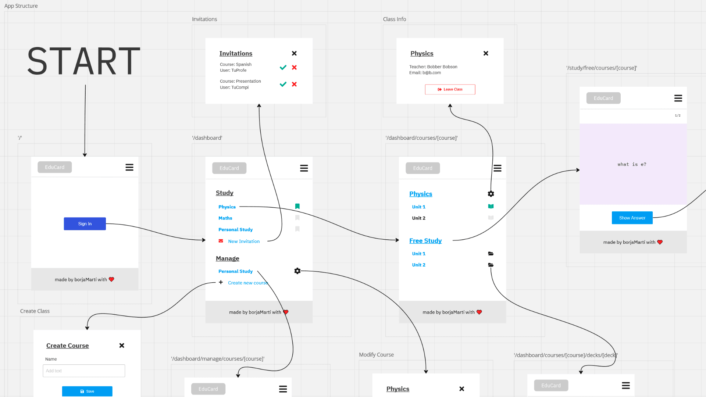

<p align="center">
  <br>
    
  <br>
</p>

# EduCard

EduCard is a web application that helps teachers develop their students' active recall and spaced repetition habits by using flashcards.

As a teacher, create courses and decks of flashcards and share them with your students.

As a student, study cards and get individual reminders to review them based on your recalling performance.

(Or do both!)

https://github.com/borjaMarti/educard/assets/86715948/ec3edf9e-2f33-4256-bbb6-16bcaf1aa0d1

<details>
<summary>Table of contents</summary>

- [Overview](#overview)
  - [Link](#link)
  - [The Challenge](#the-challenge)
  - [Features](#features)
- [My Process](#my-process)
  - [Built With](#built-with)
  - [How I Did It](#how-i-did-it)
  - [What I Learned](#what-i-learned)
  - [Continued Development](#continued-development)
  - [Useful Resources](#useful-resources)
- [Installation](#installation)
  - [External Dependencies](#external-dependencies)
  - [Environment Variables](#environment-variables)
  - [Running](#running)
- [Author](#author)
- [Acknowledgments](#acknowledgments)

</details>

## Overview

### Link

- Live Site: [https://educard.es](https://educard.es)

Note - If you don't want to create a new user to test the application, you can log in using the following account:

Email: **educardtest@proton.me**<br>
Password: **edutesting123**

### The Challenge

The two study methods [proven to be the most effective](https://scholar.google.es/scholar_url?url=https://bibliotecadigital.mineduc.cl/bitstream/handle/20.500.12365/17388/dunloskyimprovinglearning.pdf&hl=en&sa=X&ei=iyMEZd7_CNmDy9YPj-Ki8Ag&scisig=AFWwaeaysE_TSEk3SAVaAbKvAOTU&oi=scholarr) are active recall testing, which consists of actively trying to remember the content we want to memorize, for example, by asking ourselves questions about what we just read, and spaced repetition, done by studying continuously and progressively, as opposed to cramming everything the day before an exam. A very efficient way to combine these techniques is using flashcards. By following a system such as [Leitner's](https://en.wikipedia.org/wiki/Leitner_system), we can determine which cards need a higher frequency of repetition to consolidate, thus flattening the specific [forgetting curve](https://en.wikipedia.org/wiki/Forgetting_curve) of each one without wasting time reviewing the information we've already memorized.

(If you want a more in-depth look into the topic, check the [Useful Resources](#useful-resources) section)

These are the reasons why, for my study, I use a flashcard app, [Anki](https://apps.ankiweb.net/). Anki allows users to create their own decks of flashcards, study them, and schedule the cards' next study session following an algorithm based on the difficulty they had recalling. While working as a teacher, I wanted to help my students develop their study habits and techniques using a similar system. While Anki is a powerful tool, it may prove too complex for younger students. Furthermore, because of its orientation towards personal learning, it lacks features that allow users to interact directly (you can share decks, but only through exporting/importing files). When thinking about using flashcards with students, I felt I needed a more streamlined, intuitive tool that allowed teachers to create and share decks with their students in a non-cumbersome way.

Enter [EduCard](https://educard.es).


EduCard's objective is to give teachers (and students) an easy-to-use tool that allows them to create decks of flashcards that can be shared effortlessly with their students, with the ability to modify them on the fly without their students having to do anything. It serves as an introduction to the methodology of spaced repetition and active recall testing that nurtured will serve the students for their life-long learning journeys.

As a teacher, you create courses and populate them with the subjects' flashcards, organized by decks that could represent learning units or discrete topics. Then, you can invite your students to give them access to your collection. The moment they are part of the course, EduCard creates a record for each of the cards and students, keeping track of when the student should review the card to keep it in memory based on past performance reviewing it.

### Features

🗃️ Create courses and organize your flashcards into decks<br>
✉️ Invite your students to share the cards with them<br>
📈 Practice active recall efficiently by following a spaced repetition algorithm<br>

## My Process

### Built With

[![JavaScript][js-badge]][js-url]
[![React][react-badge]][react-url]
[![Next.js][next.js-badge]][next.js-url]
[![MongoDB][mongodb-badge]][mongodb-url]
[![Mongoose][mongoose-badge]][mongoose-url]
[![Node.js][node.js-badge]][node.js-url]

And also...

- [HTML5](https://html.spec.whatwg.org/) - Semantically rich HTML
- [CSS3](https://www.w3.org/Style/CSS/specs.en.html/) - Custom CSS with mobile-first workflow
- [BEM](https://getbem.com/) - BEM naming methodology for better-structured CSS
- [Clerk](https://clerk.com/) - Authentication and user management
- [Svix](https://www.svix.com/) - Webhooks platform
- [Postman](https://www.postman.com/) - Endpoint testing
- [Miro](https://miro.com/) - For initial app design/use-flow sketches
- [Inkscape](https://inkscape.org/) - SVG editing
- [Vercel](https://vercel.com/) - Deployment service
- [Atlas](https://www.mongodb.com/atlas/database) - Database hosting

### How I Did It

When I had a clear idea of what EduCard's purpose would be, I started thinking about which features I would need for the minimal expression of EduCard (that is to say, the Minimal Viable Product). To organize my thinking, I used Miro to make a mock-up of the application and the business logic of the database. You can check it out here, including the iterations I went over for the database structure:

[EduCard's Miro Board](https://miro.com/app/board/uXjVMEoRV0k=/?share_link_id=891155910537)




Once I was happy with the design and structure, it was time to code it. I needed data persistence across devices and user authentication, which spelled full-stack application. I'd already been working with React for a while and knew it would fit the study part of the application well, so it seemed like a good option. I also needed a web framework to handle the routing. Next.js had just marked its new app directory [as stable](https://nextjs.org/blog/next-13-4), and I was intrigued by the features it offered - specifically, the distinction between client and server components, the way route handlers are structured, and data fetching from server components - so I decided to give it a shot and learn the most current technology.

For persistence, I had experience with MongoDB and Mongoose from previous projects, paired with the option to host the database at Mongo Atlas, I went with those (note that if I had to do it again, I might use a relational database - more info on the [Continued Development](#continued-development) section).

Next, I had to decide how to implement the user authentication strategy. I had experience using [Passport.js](https://www.passportjs.org/), but that was using the [Express.js](https://expressjs.com/) framework, and, given how recent the new Next.js app router was, I had a hard time finding docs/examples of Passport.js integration. In my search, I came across [Clerk](https://clerk.com/), and looking through their docs, I noticed they had already prepared for integration with Next.js's app router before its stable release. It offered all the functionality I needed, and I could connect their database to mine via webhooks through [Svix](https://www.svix.com/), so I went with them.

Now that I had chosen the stack, I started setting up my back end in Next.js. Next.js uses a [file-system-based router](https://nextjs.org/docs/app/building-your-application/routing), where folders define routes, and files create the UI for a given route segment. , [Route Handlers](https://nextjs.org/docs/app/building-your-application/routing/route-handlers) define server-side API endpoints, and `route.js` files represent them. The root folder inside the project directory (`app` in my case) acts as the `/` endpoint, and new folders and sub-folders with `route.js` files inside them will represent the given endpoint. Inside `route.js`, the exported functions handle each HTTP Request Method. The following is a function example from `app/api/courses` `route.js` (note that the endpoint would then be `domain.url/api/courses`):

```js
// @desc Create new course.
// @route POST /api/courses
export async function POST(req) {
  await dbConnect();
  const { userId } = getAuth(req);
  const data = await req.json();

  try {
    const course = await Course.create({
      ownerId: userId,
      courseName: data.name,
    });

    return NextResponse.json(course);
  } catch (err) {
    console.log(err);
  }
}
```

During the endpoint set-up process, I used [Postman](https://www.postman.com/) to test the functionality.

Finally, with all the back end in place, it was time for the front end. The client-side routing is also straightforward with Next.js. `page.jsx` files define the UI for a given endpoint and make it publicly accessible. Inside `page.jsx` files, there is a default exported function, just as if it were a React component. By default, all `page.jsx` files are [Server Components](https://nextjs.org/docs/app/building-your-application/rendering/server-components), meaning they are rendered (and cached) on the server, helping with Search Engine Optimization and allowing asynchronous data fetching.

Then, for any components that needed interactivity (or the usage of React's hooks), I created regular React components with a `"use client"` declaration, indicating to Next.js that these were [Client Components](https://nextjs.org/docs/app/building-your-application/rendering/client-components). I found [this article](https://profy.dev/article/react-folder-structure) on React folder structures, which helped organizing my components by features, thus improving clarity.

One of my goals for this project was building my components without using any libraries to consolidate my React knowledge, leading me to learn some new things, which I'll go more in-depth about in the following section. My main focus when building components was accessibility. The [A11y Project](https://www.a11yproject.com/checklist/) and [MDN Docs](https://developer.mozilla.org/) guided my decisions on the topic. [React Aria](https://react-spectrum.adobe.com/react-aria/), with its focus on accessibility, was also an inspiration.

Another significant part of the front-end creation process was following a mobile-first workflow. My target userbase (students, young people) mainly use the internet through mobile phones, so it only made sense to cater the design towards that.

The UI design of the application strives for clarity, letting users fulfill its chief objective: to teach and to (meaningfully) learn.

### What I Learned

Here are some (not all) of the topics I learned about while working on the project:

- Next.js Routing

- Webhooks

When I decided to use an external provider for user management and authentication, one of the core issues was synchronizing their database with EduCard's. EduCard needs the users emails and names to manage course invitations and student-teacher interactions, but the external service handles this info, not EduCard.

[Clerk](https://clerk.com/) solves this by facilitating connections to a project's back end using webhooks. You set up an endpoint on the back end and configure Clerk to send the required data when a specified event happens (such as a user creation). To secure and ensure a reliable connection between Clerk's database and your endpoint, Clerk uses [Svix](https://www.svix.com/) to handle the webhooks. The following is a snippet of my `/api/webhooks/user` endpoint showing how it's configured:

```js
const webhookSecret = process.env.WEBHOOK_SECRET;

// @desc This webhook activates whenever a user is created/modified/deleted
// in the Clerk database (authentication provider), allowing to mirror the
// action in the project's MongoDataBase database.
// @route POST /api/webhooks/user
export async function POST(req) {
  const payload = await req.json();
  const headersList = headers();
  // We use svix to verify the webhook's validity against our secret.
  // First we extract the relevant info from the headers:
  const heads = {
    "svix-id": headersList.get("svix-id"),
    "svix-timestamp": headersList.get("svix-timestamp"),
    "svix-signature": headersList.get("svix-signature"),
  };
  // We create a new webhook with our secret.
  const wh = new Webhook(webhookSecret);
  let msg;
  // Then we verify the headers and payload.
  try {
    msg = await wh.verify(JSON.stringify(payload), heads);
  } catch (err) {
    console.error(err.message);
    return NextResponse.json({}, { status: 400 });
  }

  // Connect to DB.
  await dbConnect();

  // Now the msg variable contains the message sent from Clerk. msg.type will indicate which event type happened on their end, and we can access the relevant data through msg.data.
  // Check the route.js file on app/api/webhooks/user to see the full implementation.
  //[...]
}
```

- Dialogs

Dialogs serve as one of the central UI components of EduCard, allowing users to have quick access to an interface when creating/modifying/deleting courses, decks, cards, and invitations.

They permit the main interface to be clean, adding the required parts for the requested interaction on the fly on top of all the other content. When researching how to implement dialogs, I heeded the many [accessibility considerations](https://developer.mozilla.org/en-US/docs/Web/HTML/Element/dialog#accessibility_considerations) raised. Because of this, I considered using an already accessibility-centered implementation, [a11y-dialog](https://a11y-dialog.netlify.app/), which has a React version, [React a11y-dialog](https://github.com/KittyGiraudel/react-a11y-dialog). The problem is that this version relies on [React portals](https://react.dev/reference/react-dom/createPortal), which require further configuration because of Next.js.

Then I came across the native [`<dialog>`](https://developer.mozilla.org/en-US/docs/Web/HTML/Element/dialog) element. Just at the start of 2022, it had achieved support in all major browsers, now having a [>90 percent of usage](https://caniuse.com/dialog) across browser versions. After reading various articles supporting the adoption of the native element over custom-made solutions, such as [this one](https://www.scottohara.me/blog/2023/01/26/use-the-dialog-element.html) by Scott O'Hara, a prominent voice in the accessibility community, I decided to build my component with it. It was a breeze because the native element already incorporates the logic to handle most of the functionality. [This tutorial](https://dev.to/link2twenty/react-using-native-dialogs-to-make-a-modal-popup-4b25) was positively helpful for implementing some missing actions (namely, closing modals on backdrop click).

### Continued Development

Room for improvement:

1- Server response handling

2- Client state vs constant fetches

3- Relational database

4- CSS modularization

### Useful Resources

- [MDN Docs](https://developer.mozilla.org/)

MDN Docs is my go-to resource for web development information.

While browsing MDN, I got prompted to complete a survey about my usage (which I did out of gratitude). That led to an invitation to participate in a 1-week study of its new AI Helper tool's UI/UX with diary entries and an interview.

- [A11y Project](https://www.a11yproject.com/checklist/)

A11y Project is superb for accessibility information, serving as a resource hub for tools, blogs, guides, books, and others.

I particularly enjoy their [Checklist](https://www.a11yproject.com/checklist/) for WCAG compliance, summarizing all the guidelines in an easy-to-read way.

- [React Docs](https://react.dev/)

React's official docs are super easy to follow and didactic. It's a great source of information.

- [React Aria](https://react-spectrum.adobe.com/react-aria/)

React Hooks library that provides accessible UI primitives. I found React Aria while researching libraries. Although, in the end, I chose not to use libraries for my components, this seemed like a compelling choice, with its marked focus on accessibility and customizability.

- [Next.js Docs](https://nextjs.org/docs/)

Unfortunately, when I decided to use Next.js 13 with its new App directory, Vercel had only just given the approval for production usage, so the documentation was (might still be) in progress. Nonetheless, they are up there with React's docs in quality.

- [Traversy Media's Next.js 13 Crash Course](https://www.youtube.com/watch?v=Y6KDk5iyrYE)

I'm super grateful for Traversy's channel. His tutorials for web development are well-produced and concise. This crash course helped me get started with Next.js in no time.

- [CSS guidelines](https://cssguidelin.es/)

These guidelines helped me improve the way I structure my HTML and CSS.

- [Evolution of a React folder structure and why to group by features right away](https://profy.dev/article/react-folder-structure)

This article helped me organize my components by feature, improving clarity.

- [How to Study for Exams - Evidence-based revision tips](https://www.youtube.com/watch?v=ukLnPbIffxE)

- [How to Study for Exams - Spaced Repetition](https://www.youtube.com/watch?v=Z-zNHHpXoMM)

## Installation

If you want to make your own copy of EduCard, you'll first need to configure the project.

Start by installing the dependencies:

`npm install`

### External Dependencies

EduCard uses [MongoDB Atlas](https://www.mongodb.com/atlas/database) for its database and [Clerk](https://clerk.com/) for authentication and user management.

You'll need to create accounts and projects for both. Follow their respective instructions for the project creation part. In the next section, you can find what you'll need to get from them to set up the app.

### Environment Variables

The following configuration is for development builds.

If you deploy the project, you must provide these variables to the hosting service's environment.

(Note 1: If you aren't using Vercel, you'll need to change `app/layout.jsx`'s metadata configuration because it's dependent on the VERCEL_URL env variable provided by Vercel)

(Note 2: For deployment, Clerk needs you to use Production mode, which requires [further configuration](https://clerk.com/docs/deployments/overview))

- Create a `.env.local` file in the root directory and add the following lines:

  - `NEXT_PUBLIC_CLERK_SIGN_IN_URL=/sign-in`
  - `NEXT_PUBLIC_CLERK_SIGN_UP_URL=/sign-up`
  - `NEXT_PUBLIC_CLERK_AFTER_SIGN_IN_URL=/dashboard`
  - `NEXT_PUBLIC_CLERK_AFTER_SIGN_UP_URL=/dashboard`
  - `NEXT_PUBLIC_APP_URL="http://localhost:3000"`

    Subsitute 3000 with whatever port you use.

  - `NEXT_PUBLIC_CLERK_PUBLISHABLE_KEY=""`

    You'll get this value from Clerk.

  - `CLERK_SECRET_KEY=""`

    You'll also get this value from Clerk.

  - `WEBHOOK_SECRET=""`

    You'll get this value enabling an endpoint through the Webhooks menu in Clerk.

    The webhook synchronizes our Mongo database to Clerk's user database.

    The endpoint must point to `(project.url)/api/webhooks/user`.

    Substitute `project.url` for the deploy link or a proxy if using localhost. I recommend using [ngrok](https://ngrok.com/) to set up a proxy for local development.

    For more info on configuring Clerk Webhooks, visit [this link](https://clerk.com/docs/users/sync-data) (or ask [me](https://github.com/borjaMarti) about it!).

  - `MONGODB_URI=""`
    You'll get this value from MongoDB Atlas when configuring your database through the "Connect using drivers" option.

### Running

And finally, use `npm run dev` to start a local instance!

## Author

- [Borja Martí](https://github.com/borjaMarti)

## Acknowledgments

Thanks to [Leon Noel](https://twitter.com/leonnoel) and the [100Devs](https://leonnoel.com/100devs/) community for helping me get started on this journey!

<!-- Markdown Links -->

[js-badge]: https://img.shields.io/badge/javascript-2e302c?style=for-the-badge&logo=javascript&logoColor=%23F7DF1E
[js-url]: https://www.ecma-international.org/publications-and-standards/standards/ecma-262/
[react-badge]: https://img.shields.io/badge/react-23272f?style=for-the-badge&logo=react&logoColor=61DAFB
[react-url]: https://reactjs.org/
[next.js-badge]: https://img.shields.io/badge/next.js-000000?style=for-the-badge&logo=nextdotjs&logoColor=white
[next.js-url]: https://nextjs.org/
[mongodb-badge]: https://img.shields.io/badge/mongodb-001d29?style=for-the-badge&logo=mongodb&logoColor=47A248
[mongodb-url]: https://www.mongodb.com/
[mongoose-badge]: https://img.shields.io/badge/mongoose-880000?style=for-the-badge&logo=mongoose&logoColor=white
[mongoose-url]: https://mongoosejs.com/
[node.js-badge]: https://img.shields.io/badge/node.js-233056?style=for-the-badge&logo=nodedotjs&logoColor=339933
[node.js-url]: https://nodejs.org/
[mongoose-badge]: https://img.shields.io/badge/mongoose-white?style=for-the-badge&logo=mongoose&logoColor=880000
[mongoose-url]: https://mongoosejs.com/
